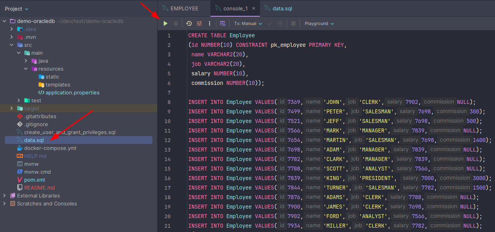

# Demo OracleDB

This is a demo project for Spring Boot with Oracle Database integration.

## Prerequisites

- Java 17
- Maven 3.9.9
- Docker

## Getting Started

1. **Clone the repository:**
   
   ```sh
   git clone https://github.com/clintonbrito/demo-oracledb.git
   cd demo-oracledb
   ```
2. **Start the Oracle Database. This can take a while until the database is up and running:**

   ```sh
   docker compose up
   ```

3. **After the database is up, you need to run the `data.sql` script to create the table and insert some data. You can use SQL Developer or any other tool to run the script.**




4. **Build the project:**   
   ```sh
   ./mvnw clean install
   ```
   
5. **Run the application:**
   
   ```sh
   ./mvnw spring-boot:run
   ```

## Configuration

Don't forget to configure your database connection in `src/main/resources/application.properties`:

```
spring.datasource.url=jdbc:oracle:thin:@localhost:1521:xe
spring.datasource.username=your_username
spring.datasource.password=your_password
spring.jpa.hibernate.ddl-auto=update
```

## Endpoints
- **GET /employees:** Retrieve a list of employees.
- **POST /employees:** Add a new employee.
- **GET /employees/{id}:** Retrieve an employee by ID.
- **PUT /employees/{id}:** Update an employee by ID.
- **DELETE /employees/{id}:** Delete an employee by ID.
